# SoloYolo
## Framweork, das aus Luftbilder der Stadt Bonn Objekte segmentiert und diese zu einem GeoPackage zusammensetzt. In diesem Fall wurde das Netz auf Solarpaneele trainiert.

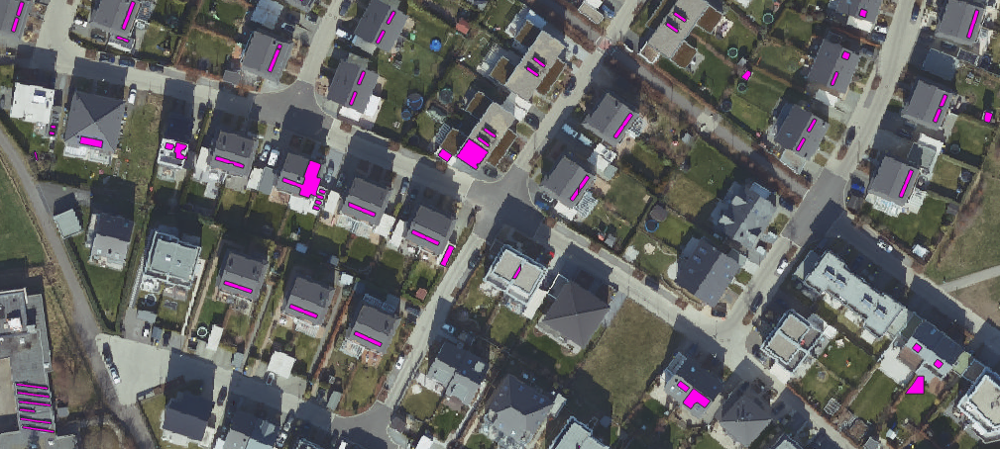

Im Folgenden soll der Weg von den Ausgangsbildern, über das Annotieren, Trainieren, Evaluieren hin zu dem fertigen Geopackage möglichst kleinschrittig erläutert werden, sodass auch Einsteiger im Bereich ML einen guten Einstieg finden. Etwas Verständnis vom Programmieren ist wünschenswert. Ich versuche alles so zu erklären, wie ich es mir als Einsteiger in die Welt des maschinellen Lernens gewünscht hätte. Bei Problemen, Anregungen und Ideen kann gerne ein Issue eröffnet werden.

Der Bereich des maschinellen Lernens, der hier angewendet wird, heißt Semantische Segmentation oder Instance Segmentation. Dabei wird ein Objekt in einem Bild erkannt und auf der Fläche des Objekts eine Maske erstellt. Dadurch lassen sich anschließend Analysen auf dieser Maske ausführen.

## Voraussetzung
Das Projekt wurde auf einem stärkeren Laptop entwickelt. Es wird jedoch empfohlen das Training und die Vorhersage von vielen Bildern auf einem Rechner mit dedizierter GPU laufen zu lassen, die CUDA unterstützt.
Die Überflugbilder der Stadt Bonn sind im TIF Format und haben eine Auflösung von 10000 x 10000 Pixel, während ein Pixel 2,5 x 2,5 cm Bodenfläche abdeckt. Da das neuronale Netz 640 x 640 Pixel große JPG-Bilder bevorzugt, muss bei der Vorverarbeitung darauf geachtet werden, ob das Zerschneiden zu einem Bild mit den entsprechenden Maßen führt. Sonst muss der Code für die Vorverarbeitung und das spätere Zusammensetzen der Bilder angepasst werden. Strikte Voraussetzung für das neuronale Netz sind quadratische Bilder mit einem Vielfachen von 32 Pixeln.

Als IDE wurde VSCode unter Linux benutzt. Es wird empfohlen Anaconda3 als Virtuelles Environmet in Version 3.11.8 einzurichten. Eine Anleitung dazu findet man [hier](https://conda.io/projects/conda/en/latest/user-guide/tasks/manage-environments.html). In diesem Environment muss dann noch die Bibliothek von Ultralytics installiert werden, die das Netz zur Segmentation, sowie erstaunlich simple Funktionen zum Training und Anwendung des Netzes bereitstellen. Dies erfolgt mit folgendem Befehl im Terminal:
```
# Install the ultralytics package using conda
conda install -c conda-forge ultralytics
```
Sollte dies nicht funktionieren ist [hier](https://docs.ultralytics.com/quickstart/) ein Guide für die Einrichtung der Umgebung.

Falls die GPU Cuda-Treiber unterstützt, sollten diese noch installiert werden. Ein Tutorial dazu für Windows findet man [hier](https://docs.nvidia.com/cuda/cuda-installation-guide-microsoft-windows/index.html) und für Linux [hier](https://docs.nvidia.com/cuda/cuda-installation-guide-linux/index.html).

Außerdem wird noch ein Account bei [Roboflow](https://roboflow.com/) benötigt. Hier kann man sehr intuitiv die Daten labeln und einen passenden Datensatz generieren. Dafür reicht eine kostenlose Mitgliedschaft.

Sollte die Einrichtung geklappt haben, ist der schwerste Teil geschafft. Bei Problemen sind Google oder ChatGPT eine große Hilfe.

## Aufbau des Projekts
Projekte im Bereich des maschinellen Lernens teilen sich grundsätzlich auf in:
- Erstellen des Datensatzes
- Trainieren des neuronalen Netzes
- Evaluieren der Performance
- Anwendung
Diese Schritte werden im Folgenden erläutert.

## Erstellen des Datensatzes
Die Qualität des Datensatzes ist absolut entscheidend für die Performance des Models. Aus minderwertigen Daten wird nie ein gut funktionierendes Model werden. Je größer und diverser der Datensatz ist, umso besser kann das Model trainieren. Hier muss eine Abwägung zwischen Zeitaufwand, vorhanden Daten und Anforderungen getroffen werden. Dafür kann keine generelle Angabe getroffen werden, da dies auch von "Schwierigkeit" abhängt, die das Model bei der Bearbeitung der Daten hat. Zudem besteht kein linearer Zusammenhang zwischen Größe des Datensatzes und der anschließenden Performance. Dieser Zusammenhang wird eher durch beschränktes Wachstum definiert. In diesem Fall haben rund 1000 annotierte Bilder mit etwa 2200 Instanzen von Solarpaneelen zu einer befriedigenden Performance geführt. Wenn die Ressourcen vorhanden sind, führt ein Datensatz von 10000 Bilder aber zu einer höheren Performance und Robustheit.

### Ausgangspunkt und Ziel
Als Ausgangspunkt sind hier konkret Tiff Bilder mit einer Auflösung von 10000 x 10000 Pixeln gegeben und am Ende erhält man einen Datensatz von gelabelten/annotierten Bildern, die das zu detektierende Objekt, sowie typischen False Positives enthalten. False Positives sind Objekte die von dem Model erkannt werden, weil sie ähnliche Eigenschaften aufweisen, aber eben nicht der Klasse entsprechen, die man segmentieren möchte. Bei der Erkennung von Solarpaneelen sind das zum Beispiel Solarthermie Anlagen, Dachfenster und Überdachungen, aber auch blaue Autos oder Bahnschienen typische False Positives.
Welche Objekte zu False Positives führen ist nicht direkt vorherzusagen. Darauf kann bei einem iterativen Vorgehen eingegangen werden, indem die False Positives in den Datensatz aufgenommen werden. Um eine noch stärkere Abgrenzung zu erreichen, kann man für "starke" False Positives eine eigene Klasse erstellen, indem man sie extra labelt. Dadurch lernt das Model diese besser zu unterscheiden. Für Solarpaneele wurden die Klassen Überdachung und Solarthermie verwendet. Das folgende Bild enthält kein Solarpanel und hilft dabei zu verstehen, vor welcher Herausforderung man steht, wenn man im urbanen Umfeld selektiv Solarpaneele detektieren will.
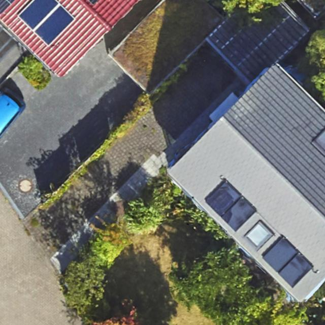

### Konkretes Vorgehen
Zunächst sollte man sich einen Querschnitt der verfügbaren Daten ansehen und ein Verständnis davon entwickeln wie Objekte, die man detektieren will aussehen. Die Varianz von simplen Objekten kann schon erstaunlich hoch sein und von Dingen abhängen, die man nicht antizipiert. Hat man eine Idee von den verfügbaren Daten und der Klasse von Objekten, die man Segmentieren möchte, sollte man eine möglichst diverse Auswahl von Bildern zusammenstellen. Dabei ist eine hohe Varianz der Bilder entscheidend. Hat man diese Bilder gesammelt, müssen diese zerschnitten werden, damit sie dem Format entsprechen, das das neuronale Netz verarbeiten kann. Die Funktion [slize.py](https://github.com/MrZinken/SoloYolo/tree/main/dataset) übernimmt dies. Hier müssen lediglich die Ordner spezifiziert werden, indem man die zu zerschneidenden Bilder abgelegt hat und die "Schnipsel" abgelegt werden sollen.
```
# Specify input and output folders
input_folder = "/home/kai/Desktop/2slice"
output_folder = "/home/kai/Desktop/sliced"
piece_size = 640 # Specify the size of each piece in pixels
```
Außerdem kann die Bildgröße definiert werden, wobei 640x640 eine sinnvoll ist. Sollten sich die Ausgangsbilder unterscheiden, muss dieses Script angepasst werden. Im Folgenden müssen immer wieder Pfade zu gewünschten Ordner spezifiziert werden. Da die Variablen für die Pfade (hoffentlich) selbsterklärend sind, werde ich darauf nicht mehr genauer eingehen.

Lässt man das Skript laufen und hat die kleineren Bilder, muss man diese durchgehen und vor allem Bilder mit den gewünschten Klassen sammeln. Dies ist relativ aufwändig und erfordert viel Zeit und Konzentration. Es ist wichtig auch Objekte zu erkennen, die nur an den Rändern in das Bild hineinreichen, damit diese auch später erkannt werden. Es ist wichtig hier auch typische False Positives mit in den Datensatz aufzunehmen und auch typische Background Bilder zu behalten. Dabei wird meistens ein Verhältnis von 10 zu 1 vorgeschlagen, von Bildern mit der Klasse zu Background Bildern. In diesem Fall wurde aber ein deutlich kleineres Verhältnis gewählt, da die False Positives ein großes Problem waren und das Model eher lernen musste, was es nicht markieren soll.
Hat man seinen vorverarbeiteten Datensatz nun gespeichert, ist es sinnvoll ein Backup davon zu erstellen, da jetzt schon viel Arbeit darin steckt.
Nun wechselt man zu Roboflow und erstellt ein Projekt:

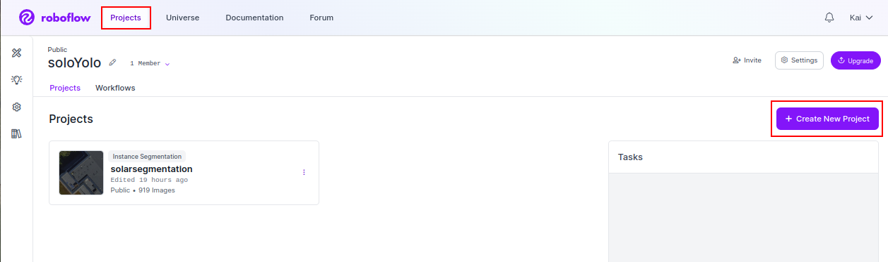

Dann legt man den Namen des Projekts, die License und die Klassen fest, die man annotieren will. Ganz wichtig an dieser Stelle ist, dass man unten die Art des Projektes festlegt, in unserem Fall Instance Segmentation:

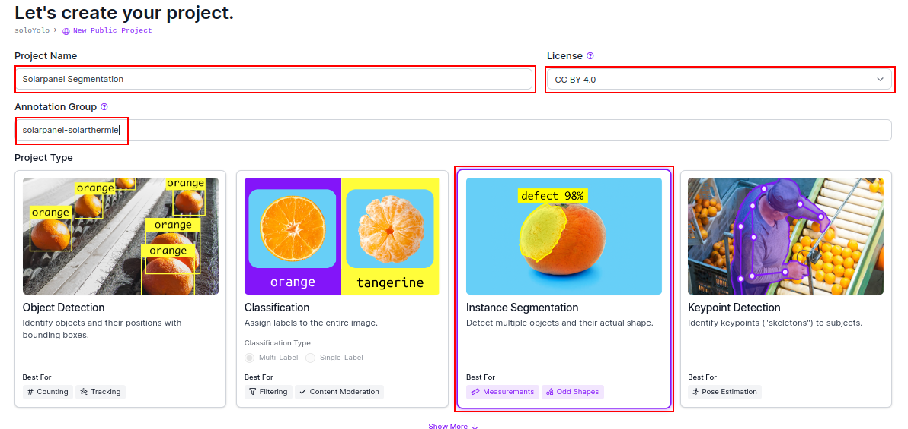

In die jetzt erscheinende Seite kann man per Drag and Drop die Bilder einfügen und diese hochladen. Mit klicken auf "Save and Continue", gelangt man auf eine Seite auf der man sich rechts zwischen 3 Methoden zum Labeln der Daten entscheiden kann. Hier sollte man "Start Manual Labeling" auswählen, da dies kostenlos ist und man die Kontrolle über die Qualität der Annotationen hat. In einem Untermenü kann ausgewählt werden, welchem Teammitglied, die Annotation zuordnen will. Wenn man Pech hat, muss man es sich selber zuordnen, indem man unten "Assign Images" anklickt. Auf der folgenden Seite gelangt man mit einem Klick auf Start Annotating endlich zu der Umgebung, in der man mit dem Markieren der Daten beginnen kann.

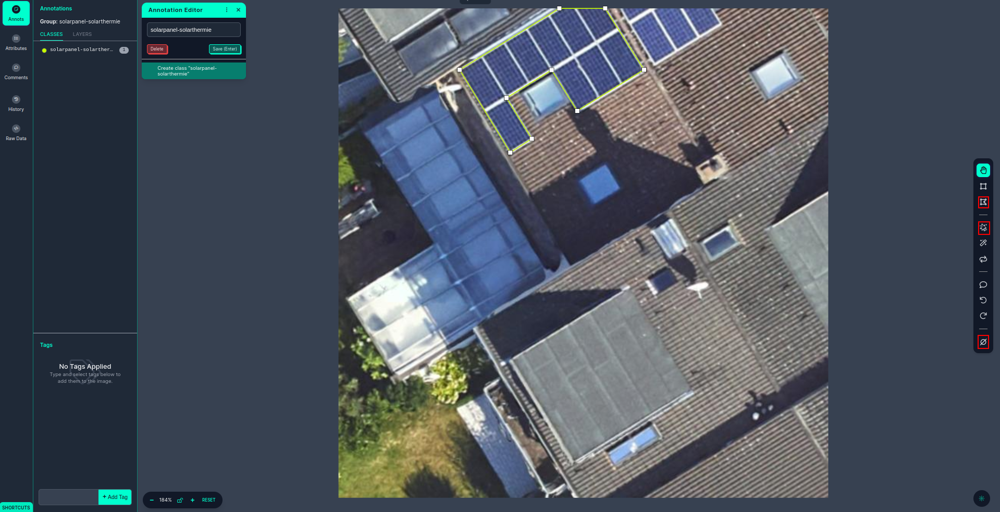

Das Vorgehen beim Annotieren, sollte intuitiv sein und hängt von den Objekten ab, die man markieren will. Dafür stehen einem grundsätzlich zwei Tools zur Verfügung. Für das Labeln von Solarpaneelen hat es sich angeboten das Polygon Tool zu verwenden, das rechts in dem obersten roten Kästchen liegt. Damit kann man Punkte definieren, die das Objekt einschließen sollen. Es ist wichtig die Objekte konsequent bis zum Rand zu markieren und darauf zu achten, dass diese nicht abgeschnitten werden. Alle Fehler, die man hier begeht, werden von dem Model übernommen. Außerdem gibt es ein Tool zur automatischen Abgrenzung, genannt "Smart Polygon, das direkt darunter liegt. Dieses ist erfahrungsgemäß aber nicht präzise genug und kostet durch die Korrektur mehr Zeit als die manuelle Abgrenzung.
Das kann aber für Objekte die keine geraden Kanten haben und mehr Kontrast gegenüber dem Hintergrund haben anders sein.
Ist das Objekt abgegrenzt, wird dies durch Drücken der Eingabetaste bestätigt und anschließend kann die gewünschte Klasse oben links gewählt werden.
Ist kein zu markierendes Objekt in dem Bild vorhanden kann rechts unten das Bild als Background markiert werden (unterstes rotes Kästchen).
Ich rate dringend zu einem spannenden Hörbuch, damit diese Tätigkeit nicht zu monoton wird.

Sobald alle Bilder gelabelt wurde, können diese in der Projektübersicht unter "Annotate" rechts oben mittels Klick auf "Add x images to Dataset" dem Datensatz hinzugefügt werden. Dabei kann die Aufteilung des Datensatzes bestimmt werden. Normalerweise werden 70 % der Bilder für das Training des Models gewählt, während 20 % für Validierung und 10 % zum Testen verwendet werden. Diese Aufteilung kann so gelassen werden oder in speziellen Fällen varriert werden.
Die annotierten Bilder könne dann unter dem Reiter "Dataset" und "Health Chek" neben anderen Informationen eingesehen werden.
Unter "Generate" auf der linken Seite wird dann der Datensatz erstellt, der für unser Model zu verarbeiten ist. Beim "Preprocessing" sind keine Änderungen nötig, man kann direkt mit "Continue" fortfahren.
Unter "Augmentation" findet man eine der hilfreichsten Tools von Roboflow. Bei der Datenaugmentation werden die gelabelten Bilder auf verschiedene Weisen verändert, während die Markierungen erhalten bleiben. Dadurch erhält man "gratis" einen größeren Datensatz, während das Model zusätzlich robuster gegenüber neuen Daten wird. Mit einem Klick auf "Add Augmentation Step" werden einem folgende Schritte angeboten:

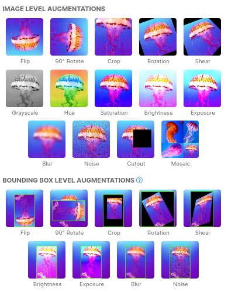

Bedenkenlos kann hier Flip, Rotate angewendet werden. Außerdem sind leichte Veränderungen mittels Hue, Saturation, Brightness und Exposure sinnvoll. Wichtig ist, dass bei diesen Schritten nur Bilder entstehen, die auch wirklich unter normalen Bedingungen entstehen. Ansonsten wird das Model auf Bilder trainiert, die es niemals sehen wird. Die Parameter, mit denen man die einzelnen Augmentation-Schritte ausführt, sollten entsprechend konservativ gewählt werden.
Anschließend dann mittels Klick auf "Continue" und "Generate" der Datensatz erstellt. Dieser ist unter Versions zu finden.
Um den Datensatz herunterladen zu können klickt man rechts oben auf "Export Dataset".
In dem Fenster das erscheint, wählt man unter dem Reiter Format "Yolov8" und wählt das Kästchen "download zip to computer" und klickt auf "Continoue":

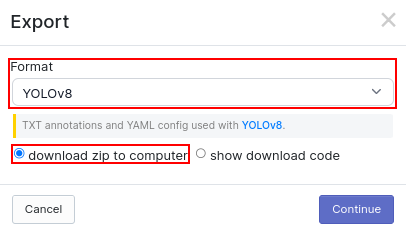

Dann beginnt der Download des Datensatzes in dem benötigten Format. Dieser sollte entpackt an einem sinnvollen Ort gespeichert werden. Von dem Trainingsdatensatz sollte ein Backup erstellt werden. Den Pfad zu "data.yaml" wird im folgenden Schritt benötigt.

Jetzt ist ein Großteil der Arbeit für uns Menschen erledigt und das Training kann beginnen.

## Training

Die Funktion für das Training ist denkbar einfach:

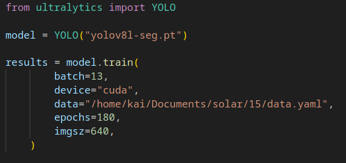

In der Variablen "model" legt man fest, welches Model von Ultralytics genutzt werden soll. Dabei gibt "yolov8" die Version an. Es wird bereits an yolov9 gearbeitet, aber dieses Model steht Anfang 2024 noch nicht für die Segmentation zur Verfügung. Das "l" steht für die Größe, in diesem Fall large. Außerdem gibt es noch "n" für nano, "s" für small, "m" für medium und "xl" für extra large. Die Endung "-seg" gibt die Funktion des Models an und steht für Segmentation. Und schließlich ist ".pt" die Dateiendung und steht für Checkpointing Model im Pickle Format.

Welche Größe man nutzt, hängt von der zur Verfügung stehenden Rechenleistung/Bearbeitungszeit ab, aber auch der Größe des Datensatzes, der Anzahl an Klassen und der Komplexität der Aufgabe ab. Als Startpunkt ist das Medium Model geeignet.

Die Variable "batch" nimmt Integerwerte an und sagt aus, wie viele Bilder pro Traingslauf(epochs) geladen werden sollen. Diese sollten unter gegebener Hardware möglichst hoch gewählt werden, da dadurch eine weniger spezifisches Lernverhalten gewährleistet wird. Dafür ist der Grafikspeicher der limitierende Faktor. Je größer das Model ist, desto weniger Speicher bleibt für die Bilder übrig.

Mit "device" kann man festlegen, ob mit der GPU trainiert werden soll. Unterstützt der Computer Cuda Treiber sollten diese dringend installiert werden und "cuda" gewählt werden. Dadurch wird die Performance deutlich gesteigert. Ist es nicht möglich Cuda Treiber zu installieren, muss hier "cpu" gewählt werden.

Mit "data" wird der Pfad zur "data.yaml" angegeben. Diese Datei liegt im Datensatz Ordner.

"epochs" gibt die Anzahl an Trainingsläufen an. Pro Epoche werden dem Neuronalen Netz alle Bilder einmal gezeigt. Es hat sich gezeigt, dass es sinnvoll ist, mit vielen Epochen zu trainieren, da sich die Performance dadurch deutlich stiegern lässt. Hier sollte ein möglichst hoher Wert gewählt werden. Bei einer zu hohen Anzahl an Epochen besteht die Gefahr des Overfitting. Einfach gesagt lernt das Model die Trainingsdaten dabei auswendig, entwickelt aber kein Verständnis von dem dahinterliegenden Konzept und ist somit nicht robust gegenüber neuen Daten. Dieses Framerwork erkennt dies jedoch und bricht das Training ab, sollte kein Performancegewinn mehr auftreten.

Schließlich gibt "imgsz" die Größe der Bilder an. Hier ist 640 der default Wert.

Führt man dieses Script aus, läuft das Training. Sollte ein Fehler geworfen werden, ist wahrscheinlich die Batch Size zu groß, oder ein Pfad ist falsch angelegt. Im ersten Fall sollte die Batch Größe sukzessive verringert werden und im zweiten die Pfade zur data.yaml und die Pfade in der data.yaml geprüft werden.

Ist das Training abgeschlossen, werden die Gewichte und einige Metriken unter "runs/segment" gespeichert. Nun sollte man sich die Ergebnisse anschauen und bestenfalls eigene Metriken erstellt werden, sollte der Testdatensatz groß genug sein.

## Performance

Sobald das Training beendet wurde, ist es wichtig einen ersten Eindruck des Trainings zu gewinnen. Einige grafische dargestellte Metriken, die automatisch von Ultraylitcs bereitgestellt werden, findet man unter runs/segment/trainx. Hier sind die unter "resluts.png" gespeicherten Graphen von Relevanz. 

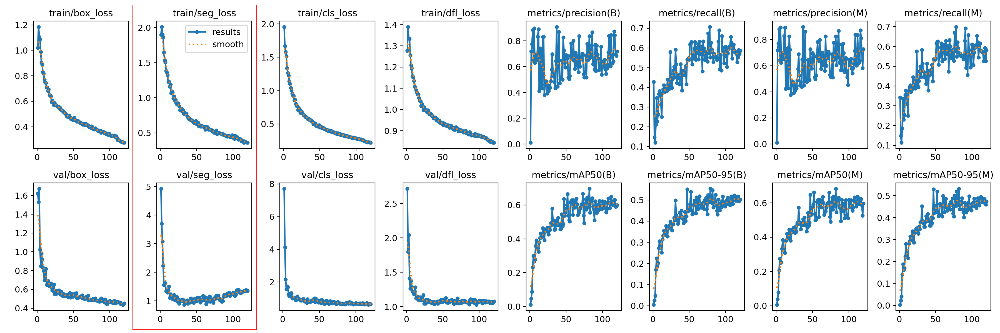 
Der Segmentation Loss, von dem Kasten rot umrandet, ist für die Segmentation die schwierigste und damit relevanteste Metrik. Diese sollte konstant sinken. Dass der Segmentation Loss auf den Validierungsdaten leicht steigt, ist nicht optimal, aber bei dem schwachen Anstieg kein großes Problem. Dennoch kann dies ein Hinweis auf ein Problem sein. So kann es sein, dass eine Klasse overfitted wird, während die anderen noch deutlich besser klassifiziert werden.
Tendenziell sollen die acht linken Graphen einen Abwärtstrend zeigen, während die rechten Graphen steigen sollten.

Die normalisierte Konfusion Matrix ist ein der nächste Punkt, um die Performance des Models zu evaluieren. Dabei sollte der Schwerpunkt auf der Diagonalen liegen. Hier zeigt sich, dass das Model in dieser Anwendung häufig Probleme mit False Positives hat.
Die Mean Average Precision (mAP) gibt eine Idee von der Präzision der Zuordnung über alle Klassen an.
Intersection over Union (IoU) ist eine Metrik um zu zeigen, wie gut die erstellte Maske über dem Ground Truth liegt.
Der F1 Score ergibt sich aus der dem Recall und der Precision und ist gibt somit einen ersten Eindruck über die Performance für False Positives und False Negatives.

Um eigene Metriken auf den Testdaten zu erstellen, muss zunächst unter mit der "just_predict.py" Prediciton Masks erstellt werden. Dafür wählt man die gewünschten Gewichte aus und den legt den Pfad zu den Testbildern fest. Dabei wird immer nur eine Klasse getestet, die in der Variable "object_class" festgelegt wird. In diesem Fall ist das solar_panel. Außerdem führt man unter "performance" "labels2masks" aus. Hier muss der Pfad zu dem Ordner mit den Labeln im Testdatensatz festgelet werden. Danach sollten die Masken mit der Vorhersage des Models im Ordner "output" und die Ground Truth Masken im Ordner "masks" gespeichert sein. Diese können visuell inspiziert werden, um einen ersten Eindruck zu bekommen. Die Masken sollten sich ähneln und müssen dieselben Namen haben.
Unter "perfomrance/average_metrics" werden dann jeweils die Pfade zu den beiden Ordnern angegeben und dieses Script ausgeführt. Dabei werden die Metriken im Terminal ausgegeben:

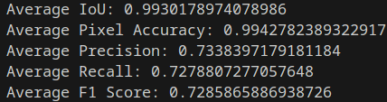

Ist die Performance zufriedenstellend kann, man mit der Anwendung des Models fortfahren, um ein Geolayer aus den Daten zu erstellen.

Hier noch der Vergleich von verschiedenen Modellen:


| Model | Dataset Size | Epochs | Batch Size | Average IoU | Average F1 Score | Average Precision | Average Recall | Average Pixel Accuracy |
|-------|--------------|--------|------------|-------------|------------------|-------------------|----------------|-----------------------|
| v8m   | 400          | 30     | 15         | 0.6416      | 0.5867           | 0.6278            | 0.5722         | 0.9777                |
| v8m   | 500          | 100    | 20         | 0.7306      | 0.6553           | 0.6705            | 0.6512         | 0.9904                |
| v8l   | 800          | 160    | 13         | 0.8735      | 0.7756           | 0.7883            | 0.7670         | 0.9953                |
| v8l   | 900          | 180    | 13         | 0.8393      | 0.7286           | 0.7338            | 0.7279         | 0.9943                |
| v9c   | 9000         | 120    | 12         | 0.8381      | 0.7354           | 0.7421            | 0.7305         | 0.9944                |

Und hier die Performance mit verschiedenen Konfidenzen:

| Model | Confidence | Average IoU | Average F1 Score | Average Precision | Average Recall | Average Pixel Accuracy |
|-------|------------|-------------|------------------|-------------------|----------------|-----------------------|
| v9c   | 0.3        | 0.8391      | 0.7359           | 0.7420            | 0.7314         | 0.9944                |
| v9c   | 0.4        | 0.8390      | 0.7358           | 0.7420            | 0.7313         | 0.9944                |
| v9c   | 0.5        | 0.8381      | 0.7354           | 0.7421            | 0.7305         | 0.9944                |
| v9c   | 0.6        | 0.8066      | 0.7092           | 0.7184            | 0.7020         | 0.9936                |
| v9c   | 0.7        | 0.8001      | 0.6961           | 0.7074            | 0.6873         | 0.9931                |


## Anwendung

Die Voraussetzung um das Model anzuwenden sind neben einem trainierten Model noch die Bilddaten im richtigen Format mit dazugehöriger Georeferenzen. Die Georeferenz dient dazu, dass die vorhergesagten Masken von Anwendungen wie QGis an den korrekten Positionen geladen werden können. Dazu muss die Georefenz als Worldfile mit demselben Namen wie das Tiff vorliegen. Die Endung von Worldfiles für Tiffs ist ".tfw".

Sind diese Voraussetzungen erfüllt müssen lediglich einige Variablen spezifiziert werden

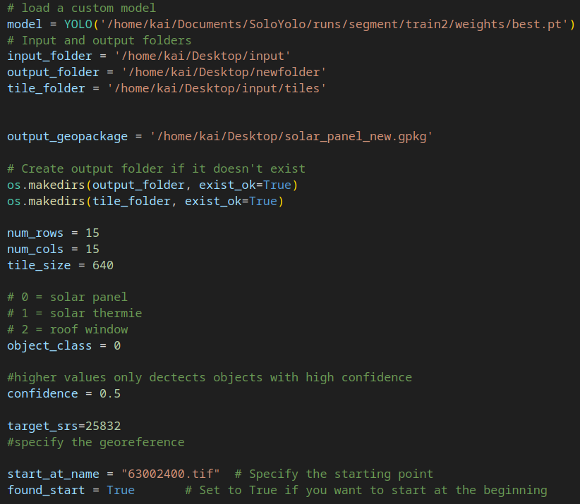

"model" gibt den Pfad zu den gewünschten Gewichten an.
Im "input_folder" werden sind die zu verabeitenden Tiff Bilder und Georeferenzen hinterlegt. Der "tile_folder" dient lediglich zur als zwischen Speicher und im "outputfolder" werden die jeweiligen GeoPackages der einzelnen Bilder gespeichert.
Die Variablen "num_rows", "num_cols" und "tile_size" sollten unverändert gelassen werden, wenn die Bilder eine Ausgangsgröße von 10000 mal 10000 Pixeln haben.
In "object_class" wird bestimmt, welche Klasse das Model erkennen soll. Die Nummer korrespondiert mit dem Wert aus data.yaml, die wiederum durch das Erstellen der Trainingsdaten erzeugt wurde.
"confidence" gibt an ab welcher Konfidenz ein Element segmentiert werden soll. Werden zu viele False Positives erkannt, kann dieser Wert erhöht werden, dabei besteht aber die Gefahr, dass zu viele True Positives übersehen werden. 0.4 oder 0.5 sind vernünftige Werte.
Unter "target_srs" kann man das Georeference System festlegen. Dies ist für NRW üblicherweise 25832.
Sollte nicht der ganze Ordner analysiert werden, kann man mit "found_start" = False und "start_at_name" festlegen, ab welchem Dateinamen vorhergesagt werden soll.

Hat man alle Variablen angepasst und lässt das Programm laufen, werden die einzelnen Tiffs zunächst auf eine Größe von 9600 mal 9600 ins JPG Format gebracht und dann in 225 Bilder zerschnitten. Die Solarpaneele werden dann in den einzelnen Bildern markiert und als Binärmaske ausgegeben. Diese Binärmasken, werden dann wieder zu einem Bild zusammengesetzt und Masken, die nahe beieinander liegen, werden verbunden. Dieser Schritt ist nötig, da es an Bildrändern öfter zu nicht erkannten Bereichen kommt. Diese zusammengesetzen Bilder entsprechen dann den Ursprungs Tiffs. Zusammen mit den Wordlfiles wird daraus dann ein Geopackage erstellt. Diese werden im Output Ordner gespeichert und nicht gelöscht. Sind alle Ausgangsbilder analysiert worden, werden die Geopackages zu einem einzelnen Geopackage zusammengesetzt.

### Nachbearbeitung

Da Verfahren im Bereich des maschinellen Lernens nicht fehlerfrei sind, kann die Qualität der finalen Daten noch durch Nachbearbeitung verbessert werden. Hier sollen einige Funktionen in QGis erläutert werden, mit denen der Vektorlayer so verändert wird, dass False Positives herausgefiltert werden, eigentlich zusammenhängende Features vereinigt werden und Defekte korrigiert werden.
Zunächst sollten Defekte mit der Funktion "v.clean" bereinigt werden, damit die folgenden Funktionen sauber arbeiten können. Dies kann mit Default Werten ausgeführt werden. 
Anschließend sollten alle Features, die kleiner als 0.5 Quadratmeter sind, herausgefiltert werden, da es sich dabei sehr wahrscheinlich um falsch erkannte Objekte handelt. ??????
Außerdem sollten alle Features entfernt werden, die nicht auf Gebäudeflächen liegen. Im urbanen Kontext liegen fast alle Solarpaneele auf Dachflächen. Dazu benötigt man einen Layer mit allen Gebäuden.?????
Danach können Features vereinigt werden, indem man "Buffer" mit einer Stärke von 0,02 m anwendet und die sich nun überlappenden Features mittels "Dissolve" vereinigt. Anschließend muss Buffer mit -0,02 m angewendet werden, um zu der ursprünglichen Größe der Features zu gelangen.
Diesen Layer kann man mittels "Simplify" vereinfachen. Dabei sollte ein Wert von etwa 0,1 m gewählt werden. Durch diese Glättung wird die Speichergröße des Datensatzes nicht nur verkleinert, sonder nähert sich deutlich den reellen Flächen an.


Glückwunsch, damit wurde ein Layer von dem gesuchten Objekt erstellt, das nun beliebig analysiert werden kann.
